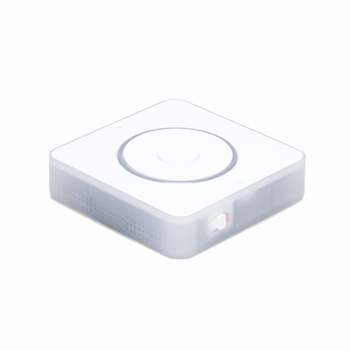
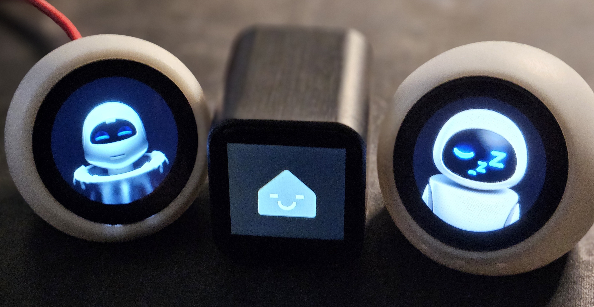
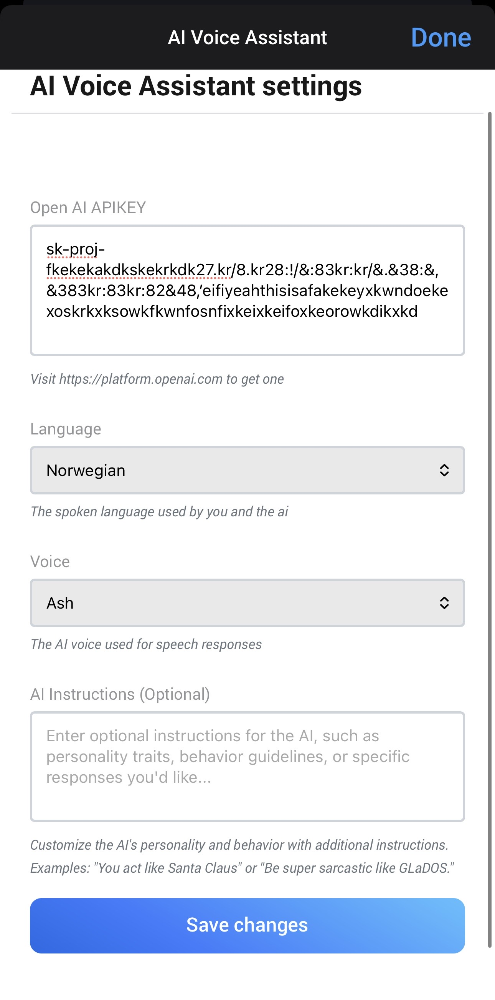

# AI Voice Assistant for Homey


Talk to your smart home. This Homey app connects small, inexpensive ESP32-based voice devices
(Home Assistant Voice Preview Edition, XiaoZhi AI) to an AI assistant that controls your Homey
devices, answers questions, runs timers, and speaks back — in your language.

You choose the brain: **OpenAI**, **Google Gemini**, or a fully **local / self-hosted** pipeline
(Whisper + Ollama + Piper and friends) where no audio ever leaves your network.

> **Status:** Active development. Open work lives in [TODO.md](./TODO.md); finished work is
> archived in [COMPLETED.md](./COMPLETED.md).

---

## What you can do by voice

Wake the device with its wake word (e.g. *"Okay Nabu"* on the Voice PE) or press its button, then
just speak naturally:

* **Control devices** — turn lights, plugs and other devices on/off, dim lights, set thermostat
  temperatures, in any room/zone.
* **Lock & unlock doors** — control supported smart locks.
* **Ask about the weather** — current conditions and forecasts for your location.
* **Ask the time & date** — answered from your Homey's local time and timezone.
* **Set timers & alarms** — *"set a 10 minute timer"*, *"wake me at 7"*. The device counts down on
  its LED ring and chimes when time's up; cancel or check it by voice.
* **Have a conversation** — the assistant keeps listening after it answers, so you can ask
  follow-up questions without repeating the wake word.
* **Ask anything** — general questions answered by the AI.
* **Search the web** — *"what's playing at the cinema today?"*, *"when does the next bus leave?"* —
  current and local information via OpenAI web search or the Brave Search API (pick one in settings).
* **Manage your Bring! shopping list** — *"what's on the shopping list?"*, *"add milk"*, *"take bread
  off the list"*. If you add something that's already there, the assistant asks whether to increase
  the amount or leave it. Opt-in — enable it and enter your Bring! account details in settings.
* **Ask for help** — *"what can you do?"* and the assistant explains its own capabilities.

The assistant understands and replies in **English, Dutch, German, French, Italian, Swedish,
Norwegian, Spanish, Danish, Russian, Polish and Korean** — pick yours in the app settings.

---

## Quick start

1. **Flash** your device with ESPHome firmware and get it on your Wi-Fi
   (see [Hardware setup](#hardware-setup) below).
2. **Install** this app on your Homey.
3. In the app settings, **choose an AI engine** and enter the matching API key
   (or point it at your local services — see [Choosing an AI engine](#choosing-an-ai-engine)).
4. **Add the device** in Homey — it's discovered automatically on your LAN.
5. **Say the wake word** and ask something — or test from a Flow with the
   *Ask the assistant* / *Say* cards.

---

## Hardware setup

The app talks to any supported device over your LAN using the ESPHome native API (port 6053) —
no Home Assistant installation is needed, and nothing extra runs on the device beyond its
standard ESPHome firmware.

> **Note:** the app connects to the ESPHome API in plaintext. If your device has an API
> **encryption key** configured (common when a device was previously adopted by Home Assistant),
> remove the key from its ESPHome config — encrypted connections are not supported yet.

### 1) Home Assistant Voice: Preview Edition (PE)



A ready-made voice satellite by Nabu Casa with a good microphone array, speaker, LED ring and
on-device wake word (default: *"Okay Nabu"*). **Firmware:** official ESPHome firmware — stock,
no modifications needed.

**How to flash / (re)install**

1. Use a Chromium-based browser (Chrome/Edge) that supports Web Serial.
2. Open the installer: [https://esphome.github.io/home-assistant-voice-pe/](https://esphome.github.io/home-assistant-voice-pe/)
3. Click **Connect**, choose the device's COM/USB port.
4. Pick a firmware version and click **Install**.
5. When prompted, enter your Wi-Fi credentials.
6. After boot, optionally assign a **static IP** in your router/DHCP.

**Tips**

* You can update/monitor later using the ESPHome Web tools.
* If the device doesn't appear for OTA updates, try power-cycling and ensure your network
  resolves the device hostname.

### 2) XiaoZhi AI devices (RealDeco firmware)





Cheap and cheerful ESP32-S3 gadgets in many shapes (some with screens). They ship with
proprietary firmware, so they must be re-flashed. **Firmware:** community ESPHome configs by
RealDeco.

**How to flash**

1. Connect the XiaoZhi via USB.
2. Go to the RealDeco repo for your model: [https://github.com/RealDeco/xiaozhi-esphome](https://github.com/RealDeco/xiaozhi-esphome)
3. Use **ESPHome Web** ([https://web.esphome.io/](https://web.esphome.io/)) to do the first flash if needed.
4. In ESPHome, create or take over the device, paste the config from the repo, keep the
   **device name** unchanged, and install.
5. First-time install may require USB flashing to update partitions; later you can update OTA.

**Notes**

* Some models have different screens/touch options — use the matching YAML.
* If a device gets stuck after a wrong name/config, enter bootloader mode (usually
  holding/combining buttons) and re-flash over USB.

---

## Choosing an AI engine

Select the **Voice provider** in the app settings. You only need credentials for the engine you
actually use.

### OpenAI Realtime (cloud)

One WebSocket session handles speech-to-text, reasoning and text-to-speech with very low
latency. Get an API key:

1. Sign in at [https://platform.openai.com/](https://platform.openai.com/)
2. Go to **API keys** and **Create new secret key**.
3. Paste it into the app settings in Homey (keep it secret).

A **Model quality** setting picks between **Full** (`gpt-realtime`, best quality) and **Mini**
(`gpt-realtime-mini`, a fraction of the cost and a bit faster). If your OpenAI quota runs low,
the app warns you with a Homey notification before requests start failing.

> If your OpenAI account is new, you may need to add billing to enable API usage.

### Google Gemini Live (cloud)

The same real-time pipeline, powered by Gemini. Get an API key:

1. Sign in at [https://aistudio.google.com/apikey](https://aistudio.google.com/apikey)
2. **Create API key** and copy it.
3. Paste it into the app settings in Homey.

### Local / self-hosted (private)

Run the whole pipeline on your own hardware — speech never has to leave your LAN. The pipeline
has three stages, and **each stage is independently pluggable**, so you can mix and match (e.g.
local Whisper + cloud Mistral LLM + local Piper):

| Stage | Options |
|---|---|
| **Speech-to-text** | Whisper over HTTP (whisper-asr-webservice, speaches, whisper.cpp) · Wyoming faster-whisper (the Home Assistant `rhasspy/wyoming-whisper` docker) · Mistral Voxtral (cloud) · Mistral Voxtral **Realtime** (cloud, streaming websocket, sub-500 ms) · any OpenAI-compatible server |
| **Language model** | Ollama · LM Studio · Mistral (cloud) · any OpenAI-compatible server (Groq, OpenRouter, DeepSeek, llama.cpp, vLLM, …) |
| **Text-to-speech** | Piper over HTTP · Wyoming Piper (the `rhasspy/wyoming-piper` docker) · Mistral Voxtral (cloud) · any OpenAI-compatible server (e.g. kokoro-fastapi) |

Each stage has its own host/port (or URL/key/model) settings, and a **Test button** that runs a
real mini-request from your Homey — wrong ports, model names, keys and voices show up immediately
with the actual error and latency.

Smart-home control, weather, timers and the rest of the tool set work the same on all three
engines.

---

## App settings



* **Voice provider** — **OpenAI Realtime**, **Google Gemini Live**, or **Local**.
* **API key** — for the selected cloud provider (OpenAI or Gemini).
* **Model quality** *(OpenAI only)* — **Full** for the best understanding, **Mini** for a much
  cheaper, slightly faster model.
* **Language** — the language you'll speak with the assistant.
* **Voice** — the voice the assistant speaks with. The list adapts to the selected provider
  (and, for the local engine, to the selected TTS backend).
* **Optional AI instructions** — personality or behaviour tweaks. Be careful: this **will**
  affect the AI. Write it in English.
* **Web search** — **OpenAI web search** (uses your OpenAI key), **Brave Search API** (its own
  free-tier key), or **Disabled**.
* **Bring! shopping list** *(opt-in)* — tick the box and enter your Bring! account e-mail and
  password to let the assistant read and edit your shopping list. Optionally name a specific list
  (defaults to your account's default list). While it's off, the shopping-list tools and prompt
  aren't loaded at all.
* **Local pipeline settings** *(Local provider only)* — per-stage backend choice plus host/port
  or URL/key/model for each, with Test buttons.

Settings changes apply on the fly — no app restart needed.

**Per-device settings** (on the device in Homey): *Initial audio skip* and *Follow-up audio skip*
trim a few milliseconds from the start of each turn to swallow the wake-word sound / mic-open
noise, should you ever hear the assistant react to itself.

---

## Using it in Flows

### Device tile

Each voice device appears in Homey with on/off (session), **volume** and **mute** controls.
While a timer runs, the tile also shows the timer's **name** and **time remaining**, counting
down live.

### Flow cards

**Triggers (When…)**

* A timer is started / finished / cancelled
* Plus standard device triggers (turned on/off, volume changed)

**Conditions (And…)**

* Is muted
* A timer is / is not running
* Plus the standard "is turned on" condition

**Actions (Then…)**

* **Ask the assistant** a question — answer returned as **text** (a tag you can use later in the
  Flow)
* **Ask the assistant** a question — answer **spoken** on the device
* **Say** something — text-to-speech on the device speaker
* **Play an audio URL** on the device speaker (must be **.flac**)
* **Start a timer** / **Cancel the timer**
* Plus standard device actions (turn on/off, set volume, mute/unmute)

> Names may vary slightly as the app evolves — see the in-app Flow picker for the authoritative
> list.

---

## How it works

```
 ESP32 device  ── LAN (TCP :6053, ESPHome native API) ──  Homey app  ── cloud or LAN ──  AI engine
 mic · speaker                                            this app                       OpenAI / Gemini /
 wake word · LED ring                                                                    Whisper+Ollama+Piper
```

1. **Wake & stream.** The wake word is detected *on the device*. It then streams raw microphone
   audio (16 kHz PCM) to the Homey app over the ESPHome native API — the same LAN protocol Home
   Assistant uses, so stock firmware just works.
2. **Understand.** The app forwards the audio to the selected engine. Cloud engines (OpenAI /
   Gemini) do speech detection, transcription and reasoning in one real-time session; the local
   engine chains its own voice-activity detection → STT → LLM.
3. **Act.** The AI doesn't just chat — it gets a set of **tools**: query and control your Homey
   devices and zones, read the weather and local time, and manage timers. When you say *"turn off
   the kitchen lights"*, the model calls a tool and the app executes it through Homey's API.
4. **Reply.** The spoken answer is encoded to FLAC and served from a small HTTP server inside the
   app; the device fetches and plays it over the LAN. After answering, the mic reopens so you can
   ask a follow-up — the session ends when you stay silent.
5. **Timers** live in the app (not the device), so they survive brief disconnects; the device
   renders the countdown on its LED ring and chimes when a timer finishes.

Everything between the device and the app stays on your LAN. What leaves your network depends
entirely on the engine you pick — with the local pipeline, nothing does.

---

## Troubleshooting

* **Device not found during pairing:** make sure it's powered, on the same LAN/subnet as Homey,
  and has no ESPHome API **encryption key** set (see the note under Hardware setup).
* **No audio/response:** check the device volume and mute state, and confirm the selected
  engine's API key (or local service hosts) are set — use the settings page's **Test** buttons
  for the local pipeline.
* **The assistant reacts to its own wake word sound:** increase the device's *Initial audio
  skip* setting slightly.
* **Flashing/USB issues:** try another USB cable/port; if needed, enter bootloader mode and
  re-flash.
* **Device not updating OTA:** ensure it's online and reachable; verify hostname/DNS on your LAN.

---

## Privacy & security

* Your API keys stay in your Homey app settings; sensitive values are masked in the app logs.
* With a **cloud** engine, audio and text are sent to **OpenAI** or **Google** (or **Mistral**,
  if selected for a local-pipeline stage) to fulfil your requests. Don't use those engines if
  that's not acceptable for your environment.
* With a fully **local** pipeline, audio and text stay on your own network.

---

## Developing

Want to contribute or experiment? You can run the app **without Homey hardware** using the
built-in emulator:

```bash
npm install
npm run build      # compile TypeScript (.mts -> .homeybuild/)
npm test           # run the test suite (vitest)
npm run emulator   # run the app without a Homey
```

See [emulator/README.md](./emulator/README.md) for details. Running on real hardware uses the
Homey CLI (`homey app run --remote`). Architecture notes for contributors are in
[CLAUDE.md](./CLAUDE.md); protocol references live under
[docs/](./docs/home-assistant-voice-preview-edition/).

---

## Roadmap

Planned features and open tasks live in **[TODO.md](./TODO.md)** (with a release-testing
checklist at the top). Completed work — including detailed write-ups of past bugs and their
fixes — is archived in **[COMPLETED.md](./COMPLETED.md)**.

---

## Acknowledgements

* **ESPHome** and the Home Assistant community
* **RealDeco** for the XiaoZhi ESPHome configs
* Everyone experimenting with tiny ESP32 voice devices 💛
