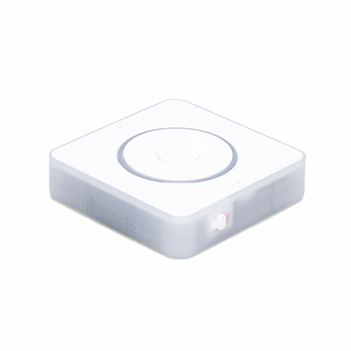

# AI Voice Assistant for Homey

A Homey app that connects small ESP32-based voice devices to OpenAI so you can talk to your smart home. The app bridges on‑device microphones/speakers with cloud STT/LLM/TTS, exposes handy Flow cards, and keeps things simple enough to flash and use on inexpensive hardware.

> **Status:** Early preview. See [todo.md](./todo.md) for planned features and open tasks.

---

## Supported devices

### 1) Home Assistant Voice: Preview Edition (PE)

**Firmware**: Official ESPHome firmware.

**How to flash / (re)install**

1. Use a Chromium‑based browser (Chrome/Edge) that supports Web Serial.
2. Open the installer: [https://esphome.github.io/home-assistant-voice-pe/](https://esphome.github.io/home-assistant-voice-pe/)
3. Click **Connect**, choose the device’s COM/USB port.
4. Pick a firmware version and click **Install**.
5. When prompted, enter your Wi‑Fi credentials.
6. After boot, optionally assign a **static IP** in your router/DHCP.

**Tips**

* You can update/monitor later using the ESPHome Web tools.
* If the device doesn’t appear for OTA updates, try power‑cycling and ensure your network resolves the device hostname.

---

### 2) XiaoZhi AI devices (RealDeco firmware)

**Firmware**: Community ESPHome configs by RealDeco.

**How to flash**

1. Connect the XiaoZhi via USB.
2. Go to the RealDeco repo for your model: [https://github.com/RealDeco/xiaozhi-esphome](https://github.com/RealDeco/xiaozhi-esphome)
3. Use **ESPHome Web** ([https://web.esphome.io/](https://web.esphome.io/)) to do the first flash if needed.
4. In ESPHome, create or take over the device, paste the config from the repo, keep the **device name** unchanged, and install.
5. First‑time install may require USB flashing to update partitions; later you can update OTA.

**Notes**

* Some models have different screens/touch options—use the matching YAML.
* If a device gets stuck after a wrong name/config, enter bootloader (usually holding/combining buttons) and re‑flash over USB.

---

## OpenAI API key

This app uses OpenAI for speech‑to‑text, reasoning, and text‑to‑speech.

**Create an API key**

1. Sign in at [https://platform.openai.com/](https://platform.openai.com/)
2. Go to **API keys** (account/organization settings) and **Create new secret key**.
3. Copy the key and keep it secret; you’ll paste it into the app settings in Homey.

**Where to put the key in Homey**

* Open the app **Settings** in the Homey mobile/web app.
* Paste your **OpenAI API key**, then save.

> If your OpenAI account is new, you may need to add billing to enable API usage.

---

## App settings

  - Api key - Get this from Open AI
  - Language - What language are you going to be speaking?
  - Voice - The voice in which the AI will respond.
  - Optional ai instructions - Like personality or behaviour, careful when entering text here as this **will** affect the AI. Write this instruction in English.

## Features in Homey

### Devices

* **Voice PE** and **XiaoZhi AI** appear as devices with basic controls (online status, volume where supported, and quick actions).

### Flow cards (examples)

**Triggers**

* **When** a voice session starts (Turned on)
* **When** a voice session ends (Turned odd)
* **When** the volume changed

**Conditions**

* **And** Session is active (Is turned on)
* **And** Is muted

**Actions**

* **Then** Start voice session (simulate wake word from a Flow)
* **Then** Set the volume
* **Then** Mute or unmute
* **Then** Ask assistant a question. Output as text to use in flow.
* **Then** Ask assistant a question. Output as audio on device speaker.
* **Then** Play an audio url on the device speaker. Format must be **.flac**
* **Then** Say something. Will turn text into speech and play on device speaker.

> Names may vary slightly as the app evolves—see the in‑app Flow picker for the authoritative list.

---

## Quick start

1. **Flash** your device (PE or XiaoZhi) using the steps above and connect it to Wi‑Fi.
2. **Install** this app on your Homey.
3. **Enter** your OpenAI API key in the app settings.
4. **Add** your device in Homey (pairing flow per driver).
5. **Test** by running the *Start voice session* action from a Flow, or use the device’s hardware button/wake word.

---

## Troubleshooting

* **Flashing/USB issues**: Try another USB cable/port; if needed, enter bootloader mode and re‑flash.
* **Device not updating OTA**: Ensure it’s online and reachable; verify hostname/DNS on your LAN.
* **No audio/response**: Check device volume (if applicable) and confirm your OpenAI key is set and valid.

---

## Privacy & security

* Your OpenAI API key stays in your Homey app settings.
* Audio and text are sent to OpenAI to fulfill requests. Do not use this app if that’s not acceptable for your environment.

---

## Roadmap

Planned features and ideas live in **[todo.md](./TODO.md)**.

---

## Acknowledgements

* **ESPHome** and the Home Assistant community
* **RealDeco** for the XiaoZhi ESPHome configs
* Everyone experimenting with tiny ESP32 voice devices 💛
