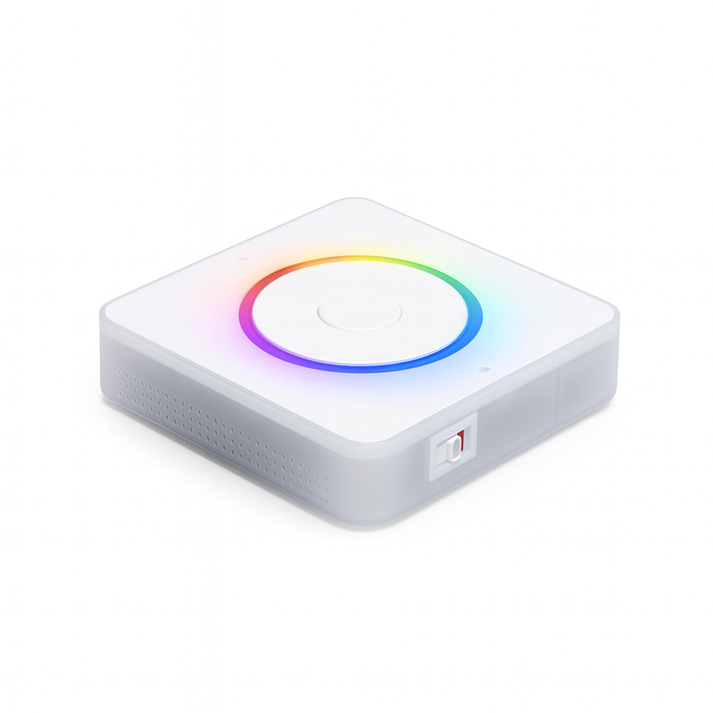

# TODO — single source of truth

This is the one place to look at the start of each session for what's left to do.
Stuff I want to bake into the app over time. Please come with suggestions :)

Two detailed reference docs feed into this list (don't duplicate their detail here, link to them):
- [`OPENAI_API_IMPROVEMENTS.md`](./OPENAI_API_IMPROVEMENTS.md) — OpenAI Realtime API audit (12 items, most done)
- [`docs/home-assistant-voice-preview-edition/implementation-gap-analysis.md`](./docs/home-assistant-voice-preview-edition/implementation-gap-analysis.md) — ESPHome native-API coverage vs. the PE docs

Legend: `[ ]` open · `[~]` partially done · `[x]` done (kept for context so we don't re-investigate)

---

## 1. ESPHome device client (`src/voice_assistant/`)

- [ ] **BUG (revisit): follow-up turn produces no audio on the PE.** Multi-turn flow: user speaks →
  Homey asks a follow-up question → user replies → **silence**. The TTS `.flac` for the second turn
  **is** generated and served — the LAN links play fine on a PC — but nothing comes out of the PE
  speaker. So FLAC encoding + HTTP serving (`WebServer`) work; the suspect is the announce/playback
  request to the device on the second turn. Investigate the announce path in
  `src/homey/voice-assistant-device.mts` / `src/voice_assistant/esp-voice-assistant-client.mts`:
  is a second `VoiceAssistantAnnounceRequest` (media URL) sent after the first response, and does the
  device need re-arming/`startConversation` between turns? Related to the follow-up feature in §3.
- [x] **BUG: devices not appearing in the pairing dialog on repeat attempts** — _fixed 2026-06-20._
  Root cause was a **reconnect leak in the discovery capability probe**, not firmware version (the
  original "v25.7 vs v26.4" framing was a red herring — both firmwares advertise `platform=ESP32` and
  pass the `txt.platform` discovery condition fine; Homey's regex match is case-insensitive).
  - **Real mechanism (confirmed live with ESP-client logging):** during pairing, the driver opens a
    one-shot `EspVoiceAssistantClient` probe per discovered device. If a probe errored or finished,
    `handleDisconnect()` would `emit('Unhealthy')` (→ driver `finish()` → `disconnect()`, which clears
    the reconnect timer) and **then** call `scheduleReconnect()` — setting a *new* timer after cleanup
    that nothing ever cleared. That orphaned timer fired `start()` → error → `scheduleReconnect()` →
    an infinite zombie reconnect loop, one per failed probe. The zombies kept hammering the device and
    occupying ESPHome's limited API connection slots, so the next dialog open failed with
    `read ETIMEDOUT` and showed no devices. An app restart killed the zombies (sockets die with the
    process) — which is why restarting "fixed" it and the first attempt always worked.
  - **Fix** (`src/voice_assistant/esp-voice-assistant-client.mts`): (1) `autoReconnect` flag derived
    from `discoveryMode` at construction — probes never reconnect; (2) terminal `closed` flag set in
    `disconnect()` so no reconnect can be scheduled after close, even from a late socket event;
    (3) `scheduleReconnect()` bails on `closed || !autoReconnect`; (4) strip socket listeners
    (`removeAllListeners()`) before `destroy()` in `disconnect()`/`handleDisconnect()`/`start()` so a
    dead socket's late close/error can't re-enter the reconnect path. Verified: repeated dialog opens
    now probe cleanly (`Scheduling reconnection` count = 0), both devices reappear every time.
  - **Related latent risk surfaced during investigation:** the newer PE firmware advertises
    `api_encryption_supported` (`Noise_...`). Plaintext still works while no key is set, but if a user
    sets an API encryption key, `api_encryption` appears and the plaintext-only client fails — see the
    Noise item below.
- [~] **Timer support** — _voice-driven timers + alarms done 2026-06-23._ `set_timer` /
  `cancel_timer` / `get_timer` tools; new `TimerManager` owns the authoritative countdown and
  sends `VoiceAssistantTimerEventResponse` (STARTED/CANCELLED/FINISHED) to the PE for the LED ring
  + finish chime. **Single timer only** — a second request makes the agent ask whether to replace.
  **Alarms** ("Sett alarm til kl 11") are timers with a duration the LLM computes from
  `get_local_time`. Re-arms the ring on reconnect. See
  [`docs/.../timer-feature.md` §9](./docs/home-assistant-voice-preview-edition/timer-feature.md).
  - **Resolved (verified on hardware 2026-06-23):**
    - A **finished/ringing** timer no longer blocks a new one — `startTimer` silently sends
      CANCELLED to stop the ring and starts the new timer (no "replace?" prompt). Only a *running*
      countdown triggers the TIMER_ALREADY_ACTIVE replace flow.
    - **LED ring re-arms on reconnect.** `reissue()` is fired from the `capabilities` event
      (handshake complete), NOT `Healthy` (which fires right after TCP connect, before the device
      subscribes to the voice assistant — a timer event sent then is dropped and the ring never shows).
    - **By design:** if a timer elapses while the device is disconnected, it does NOT ring on
      reconnect (`reissue` skips finished timers). Intended — a stale alarm shouldn't fire late.
    - **No device→host timer events to handle:** pressing the device button just triggers the mic
      (like the wake word); it does not dismiss the timer, so there's nothing to receive/clear.
  - [x] **Flow cards (done, hardware-verified 2026-06-23):** triggers (started/finished/cancelled),
    condition (timer-is-running), actions (start/cancel) — see §7.
  - [x] **Tile capabilities (done, hardware-verified 2026-06-23):** read-only
    `timer_active` / `timer_remaining` (seconds, 1 Hz tick) / `timer_name` on the device card,
    on both drivers; the device mirrors the TimerManager lifecycle onto them — see §7.
  - [x] **LED-drift resync (done 2026-06-23, pending hardware verify):** `TimerManager` re-issues a
    quiet `UPDATED` with the authoritative `seconds_left` every 30 s while a timer counts down, so the
    PE's locally-ticked LED ring can't drift on long/alarm-length countdowns (skipped while
    disconnected; `reissue()` still re-arms on reconnect). _(gap analysis #5)_
  - (Timers are intentionally **not** persisted across an app restart — an in-flight timer is dropped,
    which is the expected, least-surprising behavior.)
- [ ] **Configuration sync / wake-word selection** — parse `ListEntitiesSelectResponse`, store the
  wake-word + pipeline select keys, optionally expose wake-word choice in Homey device settings.
  _(gap analysis #7, Medium)_
- [ ] **ESPHome API encryption (Noise) + API key** — client is currently plaintext-only. If a
  satellite has an encryption key set, the connection fails entirely. Add an optional
  `encryption_key` device setting and implement the Noise handshake
  (`Noise_NNpsk0_25519_ChaChaPoly_SHA256`) before the Hello exchange.
  _(gap analysis #10, High — only needed when a user asks for it)_
- [x] **2026.1 handshake fix** — ESPHome 2026.1.0 (PE firmware 26.x) removed password auth;
  client no longer waits for `ConnectResponse`, stays backward compatible with 25.x. Verified on
  firmware 26.4.0. See `CLAUDE.md` → "ESPHome firmware compatibility".
  (The encryption item above is the remaining piece of the same area.)
- [x] Done in gap analysis: `WAKE_WORD_END`, `ERROR` events, `INTENT_PROGRESS`, version-check,
  `SubscribeStates`, extra entity-type handlers.

---

## 2. OpenAI Realtime API (`src/llm/openai-realtime-agent.mts`)

Remaining items from the audit (1–7, 10, 12 are already done — see the reference doc):

- [ ] **#8 Simplify VAD response trigger** — set `create_response: true` (+ `interrupt_response: true`)
  in `turn_detection`, drop the manual transcript re-injection / `transcript_id` tracking.
  _(Medium — also enables barge-in)_
- [ ] **#9 Expose `gpt-realtime-mini`** — add a "model quality" setting (Standard = mini vs Full)
  for the cost/quality tradeoff. _(Medium)_
- [ ] **#11 Act on `rate_limits.updated`** — log low-token warnings / surface a Homey notification
  when quota runs low. _(Low, optional)_
- [ ] **Improve STT accuracy (esp. Norwegian)** — command transcription is unreliable, particularly
  in Norwegian. Tune the transcription model + VAD settings: try `gpt-realtime-whisper`'s `delay`
  (`"medium"`/`"high"` for accuracy over latency), `noise_reduction` mode (`near_`/`far_field` for
  the room), and VAD thresholds. _(Medium — ongoing pain point)_

---

## 3. Agent tools

- [ ] **Start flows from the agent**
  - Start flow by name: "start \<flow name\>".
  - Start flow by synonym: "I'm going to bed" → starts "night mode". Needs a way for the user to
    map synonyms → flow names.
- [ ] **Follow-up / keep conversation alive** — answer a follow-up question without repeating the
  wake word (set `VoiceAssistantAnnounceRequest.startConversation = true`). Needs a timeout if the
  user has nothing to say.
- [ ] **Change settings by voice** (lots of work, but cool) — expose allowed settings (`voice`,
  `language`, `optional_ai_instructions`) as tools. Flow: agent lists options → user picks → tool
  stores the change → agent finishes its run → apply the change (socket reconnects) → optionally
  speak back in the new voice. Needs the keep-conversation-alive flag above.
- [ ] **Help!** — ask the agent what it can do.
- [ ] **When triggered from a flow, don't chunk audio** — set `pcm-segmenter` to a high
  `MIN_SILENCE_MS` (one `.flac`), or bypass the segmenter and pipe directly. Fast response time
  isn't needed from a flow — nice-to-have.

---

## 4. Custom ESPHome / PE firmware

Customizations live in `.esp_home/` (downloaded stock config + edits). Re-application guide after any
fresh config download: [`.esp_home/CUSTOMIZATIONS.md`](./.esp_home/CUSTOMIZATIONS.md).

- [x] **Custom wake word "Hey Homey"** — done via [microwakeword.com](https://microwakeword.com/).
  Gotcha that cost hours: it must be **microWakeWord** (runs on-device), NOT **openWakeWord**
  (server-side) — they have near-identical names but an openWakeWord `.tflite` flashes fine then
  crash-loops the PE (`Failed to get registration from op code SHAPE` → LoadProhibited). Model lives
  in `.esp_home/wake_words/`, referenced from the config via a **`raw.githubusercontent.com`** URL
  (the `github.com/.../raw/` redirect form fails ESPHome's model validation). See CUSTOMIZATIONS.md.
- [~] **Homey look for the LED ring** — per-phase rotating rainbows implemented (waiting + listening =
  full rainbow CW; thinking = cold rainbow CCW; replying = warm rainbow CCW). Effects + phase mapping
  documented in CUSTOMIZATIONS.md. 
  - [ ] **BUG (revisit): thinking still shows the old white pulse on-device.** The config is correct
    (`control_leds_voice_assistant_thinking_phase` → `effect: "Cold Rainbow"`, and the `"Thinking White"`
    effect is orphaned — nothing references it), but the PE keeps showing the white breathing pulse
    after stop-speaking. Strongly suspected **stale flash** (the new build isn't reaching the device —
    same trap hit earlier in this work), but unconfirmed after re-flash attempts. Next: confirm the
    running build (boot-log `compiled on` timestamp), verify the editor's config actually contains
    `Cold Rainbow`, and watch device LOGS during the thinking phase.

---

## 5. Local / offline AI

- [ ] Explore locally-hosted stack: **Whisper** (STT), **Piper** (TTS), **Ollama** (LLM) — possibly
  as a realtime agent, possibly using `gpt-oss`.
  - [Build a Simple AI Agent with gpt-oss-20b](https://www.youtube.com/watch?v=e2sgwsC92Bc)
  - [Build Anything with OpenAI's New OSS Models (n8n Agents)](https://www.youtube.com/watch?v=Myjo1amUZ08)
  - [Learn MCP (Model Context Protocol)](https://www.youtube.com/watch?v=GuTcle5edjk)

---

## 6. Phase 2 (later)

- [ ] **Image analysis** — analyze an image + prompt: "Can you see any persons in the surveillance
  image?", "Is it dark out?", "Who is at the door?"
- [ ] **Web search tool** — "What movies are in the cinema today?" (with geo it could find the
  nearest cinema).
